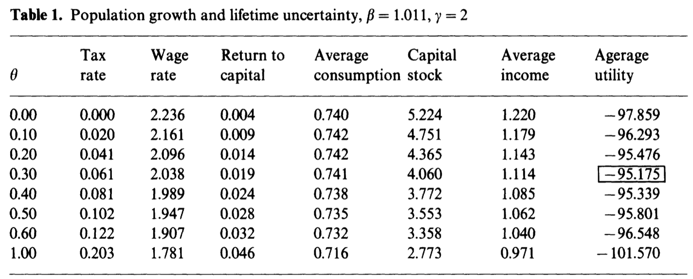
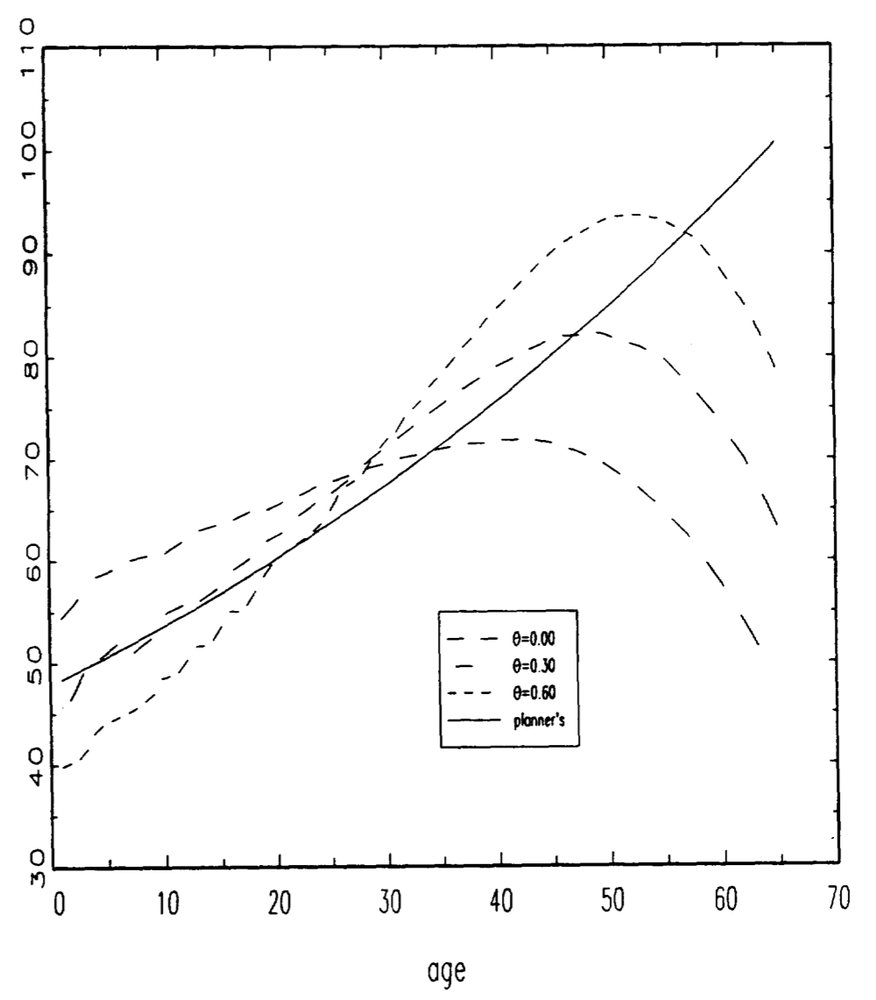
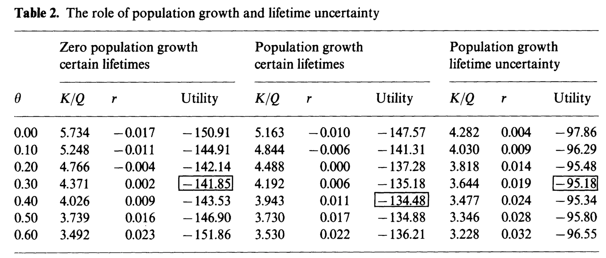
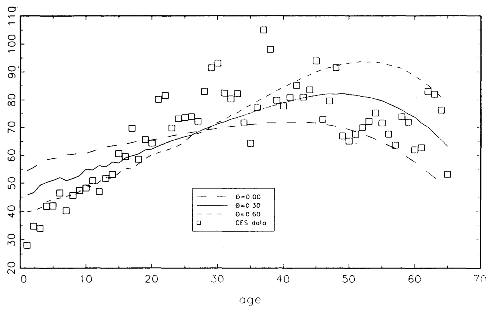
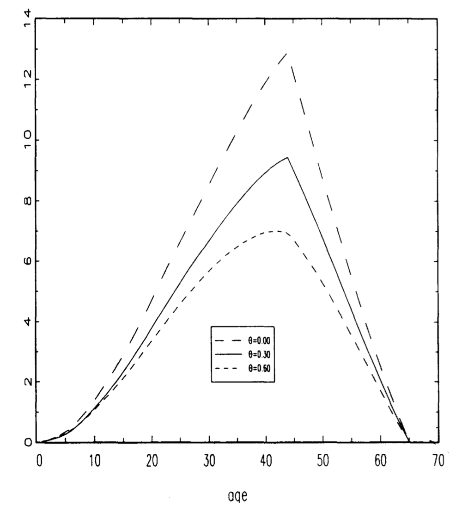
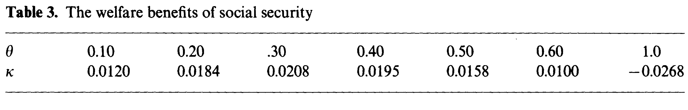
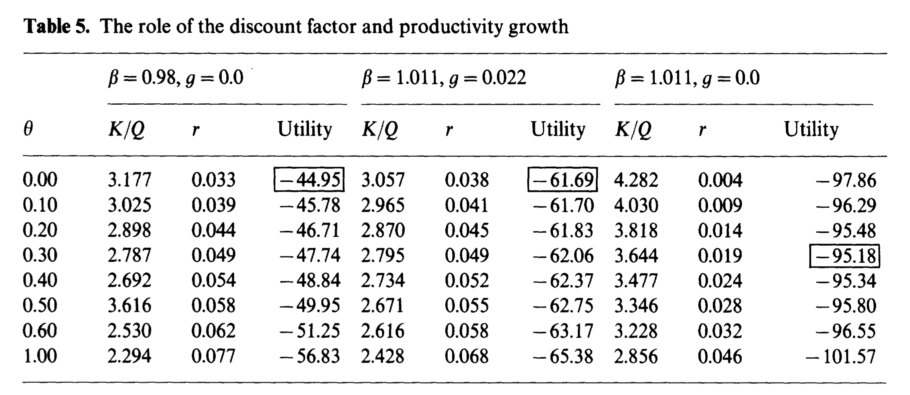

# Introduction

It is a common concern the over the adverse effect of social security on different macroeconomic variables:

-   private savings
-   negative impact on labor supply
-   incentive to retire early
-   overall impact on lifetime welfare of individuals

## Introduction

What Imrohoroglu and Joines developed in this paper is an applied general equilibrium model to examine the optimality of and the welfare benefits associated with alternative social security arrangements (different social security replacement rates).

## Important assumptions of the model

1.  Overlapping generations of 65-period lived individuals that face mortality risk and individual income risk.
2.  No bequest motives.
3.  Private credit markets including private annuities are closed.
4.  During working years, individuals face stochastic employment opportunities.
5.  Inelastic labor supply when individuals face work nature realization.

## Important assumptions of the model

6.  If individuals are unemployed they receive unemployment insurance benefits.
7.  Individuals face liquidity constraints. This implies that individuals save through private assset holdings in order to self-insure against future income fluctuations and provide old-age consumption.
8.  Social security benefits are financed with a payroll tax on the young employees.
9.  Heterogeneity at age, employment status and asset holdings level.
10. Factor prices of labor and capital are determined by the maximization problem of the firm which has constant return to scale technology.
11. Optimization problem of the individuals is a finite-state, finite-horizon, dynamic programming problem

# Description of the economy

## Preferences

_Ex ante_ identical individuals who maximize the expected, discounted lifetime utility

$$
E \sum_{j=1}^{J} \beta^{j-1}\left[\prod_{k=1}^{j} \psi_{k}\right] U\left(c_{j}\right)
$$
$\psi_j$ is the conditional probability of survival from age $j-1$ to age $j$.

Utility si assumed to take the form 

$$
U\left(c_{j}\right)=\frac{c_{j}^{1-\gamma}-1}{(1-\gamma)}
$$
The share of age-$j$ individuals in the population is given by fraction $\mu_j$, $j=1,\dots,J$, $\sum_{j=1}^{J}\mu_j=1$, where J is the maximum possible lifetime.

## Preferences 

Individuals who are below mandatory retirement age $j^*$ face a stochastic employment opportunity denoted by $s\in S=\{e,u\}$, where $e$ is employment and $u$ unemployment. The employment opportunity state follows a first-order Markov process. Transition matrix is given by $\Pi(s',s)=[\pi_{ij}], \,\, i,j=e,u$. 
Let $r$ denote the return on asset holding and $\varepsilon_j$ denote the efficiency index of an age-$j$ agent. Then the budget constraint facing an individual can be written as 

$$
y_{j}=(1+r) y_{j-1}+q_{j}-c_{j}+T, \quad y_{0} \text { given, }
$$
where $q_j$ is the disposable income, $y_j$ the end-of-period asset holdings and $T$ is a lump-sum transfer received by an individual.

## Preferences 

Liquidity constraint can be stated as $y_j\geq 0, \,\, \forall j$. Thus, there is an absence of bequest motive, $y_J=0$.

The agents are supposed to know the probability of survival between ages: some experiment death.

\begin{remark}
Therefore, there exists a technology that redistributes to alive agents assets of deceased individuals.This occurs every period and government do it by a lump-sum transfer $T$.
\end{remark}

Before mandatory retirement age $j^*$, people that work receives $w_j^e=w \varepsilon_j n_j$ where $n_j$ is the number of hours worked.

If an individual is unemployed he/she recieves unemployment insurance benefits of $w_j^u=\xi w \hat{h}$.

If $s=e$, then $n_j=\hat{h}$

## Preferences

After the mandatory retirement age of $j^*$ the disposable income of retired individuals is equal to social benefits, $b$.

$$
b= \begin{cases}0, & \text { for } j=1,2, \ldots, j^{*}-1 \\ \theta \frac{\sum_{i=1}^{j^{*}-1} w_{i}^{e}}{j^{*}-1}, & \text { for } j^{*}, j^{*}+1, \ldots, J\end{cases}
$$
Where $\theta$ is a fraction of the average lifetime employed income. This is interpreted as the unemployment insurance replacement ratio: what fraction of your lost labor income government gives you through benefits.

\begin{remark}
The only role of government is to administer the unemployment insurance and social security programs.
\end{remark}

## Preferences

The government chooses the unemployment insurance and the social security tax rates so that its budget is balanced. Under these assumptions the disposable income of an individual is given by:

$$
q_{j}= \begin{cases}\left(1-\tau_{s}-\tau_{u}\right) w_{j}^{e} & \text { for } j=1,2, \ldots, j^{*}-1, \text { if } s=e \\ w_{j}^{u} & \text { for } j=1,2, \ldots, j^{*}-1, \text { if } s=u \\ b & \text { for } j=j^{*}, j^{*}+1, \ldots, J\end{cases}
$$
The unemployment insurance replacement ratio and the associated tax rate are part of government's policy specification.

\begin{remark}
The only condition for choosing the policy instruments is that both the social security and the unemployment insurance systems be self-financing.
\end{remark}

## Technology

The production technology of the economy is given by  constant return to scale Cobb-Douglas function 

$$
Q=f(K, N) \equiv B K^{1-\alpha} N^{\alpha}.
$$
$K$ and $N$ are aggregate capital and labor inputs, respectively. The capital stock is assumed to depreciate at rate $\delta$.

The profit-maximization behavior of the firm gives to the first-order conditions which determinate the real net return to capital and the real wage 

$$
r=(1-\alpha) B\left[\frac{K}{N}\right]^{-\alpha}-\delta, \quad w=\alpha B\left[\frac{K}{N}\right]^{(1-\alpha)}
$$

## Stationary Equilibrium

The main focus of this paper is to characterize the optimal social security benefit level and this involves stationary equilibria computation for alternative social security arrangements.

The equilibrium in this paper starts with a recursive representation of the consumer's problem.

Let $D=\{d_1, d_2, \dots, d_m\}$ denote the discrete grid of points on which asset holdings will be required to fall.

For any beginning-of-period asset holding and employment status pair $(y,s) \in S \times D$, define the constraint set of an age-$j$ agent $\Omega_j(y,s)\in \mathbb{R}^2_+$ as all pairs $(c_j,y_j)$ such that the budget constraint for $j=1,2,\dots,J$ is satisfied.

Let $V_j(y,s)$ be the maximized value of objective function of an age-$j$ agent with beginning-of-period $(y,s)$. $V_j(y,s)$ is defined as the solution to the dynamic program 

## Stationary Equilibrium

$$
V_{j}(y, s)=\max _{\left(c, y^{\prime}\right) \in \Omega_{j}(y, s)}\left\{U(c)+\beta \psi_{j+1} E_{s^{\prime}} V_{j+1}\left(y^{\prime}, s^{\prime}\right)\right\}, \quad j=1,2, \ldots, J
$$

Definition: A Stationary Equilibrium for a given set of policy arrangements $\{\theta, \xi, \tau_s, \tau_u\}$ is a collection of value functions $V_j(y,s)$, individual policy rules $C_j: D\times S \rightarrow \mathbb{R}_+$, $Y_j: D \times S \rightarrow D$, age-dependent (but invariant in time) distribution of agent types $\lambda_j(y,s)$ for each age $j==1,2,\dots,J$, relative prices of labor and capital $\{w,r\}$, and lump-sum transfer $T^*$ such that:

## Stationary Equilibrium

1. Individual and aggregate behaviour are consistent:

$$
K=\sum_{j} \sum_{y} \sum_{s} \mu_{j} \lambda_{j}(y, s) y_{j-1} \quad \text { and } \quad N=\sum_{j=1}^{j^{*}-1} \sum_{y} \mu_{j} \lambda_{j}(y, s=e) \varepsilon_{j} \hat{h},
$$

2. Relative prices $\{w,r\}$ solve the firm's profit maximization problem by satisfying the first-order conditions for real net return of capital and real wage.

3. Given relative prices $\{w,r\}$, government policy $\{\theta, \xi, \tau_s, \tau_u\}$, lump-sum transfers $T^*$, the individual policy rules $C_j(y,s)$, $Y_j(y,s)$ solve the individual's dynamic program.

## Stationary Equilibrium

4. Commodity markets clear,

\begin{align*}
\sum_{j} \sum_{y} \sum_{s} \mu_{j} \lambda_{j}(y, s)\left[C_{j}(y, s)+Y_{j}(y, s)\right]&= \\
f(K, N)+(1-\delta) \sum_{j} \sum_{y} \sum_{s} \mu_{j} \lambda_{j}(y, s) Y_{j-1}(y, s)
\end{align*}

where the initial wealth distribution $Y_0$ is taken as given.

## Stationary Equilibrium

5. Collection of age-dependent, time-invariant distributions $\delta_j(y,s)$ for $j=1,2,\dots,J$ satisfies 

$$
\lambda_{j}\left(y^{\prime}, s^{\prime}\right)=\sum_{s} \sum_{y: y^{\prime}=Y_{j}(y, s)} \Pi\left(s^{\prime}, s\right) \lambda_{j-1}(y, s)
$$

6. Social security system is self-financing:

$$
\tau_{s}=\frac{\sum_{j=j^{*}}^{J} \sum_{y} \mu_{j} \lambda_{j}(y, s) b_{j}}{\sum_{j=1}^{j^{*}-1} \sum_{y} \mu_{j} \lambda_{j}(y, s=e) w \varepsilon_{j} \hat{h}}=\frac{b \sum_{j=j^{*}}^{J} \mu_{j}}{w \hat{h} \sum_{j=1}^{j^{*}-1} \mu_{j} \lambda_{j}(y, s) \varepsilon_{j}}.
$$

## Stationary Equilibrium

7. Unemployment insurance benefits program is self-financing:

$$
\tau_{u}=\frac{\sum_{j=1}^{j^{*}-1} \sum_{y} \mu_{j} \lambda_{j}(y, s=u) \xi w \hat{h}}{\sum_{j=1}^{j^{*}-1} \sum_{y} \mu_{j} \lambda_{j}(y, s=e) w \varepsilon_{j} \hat{h}}=\frac{\xi \sum_{j=1}^{j^{*}-1} \mu_{j}}{\sum_{j=1}^{j^{*}-1} \mu_{j} \varepsilon_{j}}
$$

8. Lump-sum distriburion of accidental bequests is determined by 

$$
T^{*}=\sum_{j} \sum_{y} \sum_{s} \mu_{j} \lambda_{j}(y, s)\left(1-\psi_{j+1}\right) Y_{j}(y, s).
$$

# Computational details

## Calibration

## Decision rules

## Age-dependent distributions

## Equilibrium

##  Measures of utility and welfare benefits

# Findings

## Optimal Social Security

The authors present the results using a discount factor of $\beta= 1.011$.

- Intuition of the benefit level $\theta$: If the social benefit increases, that reduces the capital stock and therefore raises the net real return of capital.

## Optimal Social Security

Without social security the economy is **dynamically inefficient**.

- A replacement rate between 10% and 20% eliminates the overaccumulation of capital.
- In this economy, the optimal social security replacement rate is 30%. 

## Optimal Social Security

- We need to note that the optimality of social security does not depend on the elimination of the dynamic inefficiency, because if we include a capital income tax of 40%, the overaccumulation disappears at a replacement rate of less than 10% and the optimal rate is still 30%.
- This optimality of social security comes from the fact that it provides insurance against uncertain lifetimes and leads to a more desirable age-consumption profile. 

## Optimal Social Security

A higher replacement rate does not necessarily result in a better consumption profile. The next graph shows that pre-retirement consumption grows more rapidly with a 60% replacement rate than it does along the path chosen by the planner.

## Optimal Social Security

## Model with different assumptions

By repeating the model with different assumptions, the authors try to identify separate contributions of the benefits of social security.

## Model with different assumptions
 
 Conclusions from this experiment:
 
- In economies with no mortality risk, the only benefit of social security comes from reducing the overaccumulation of capital.
- In economies with population growth, the degree of dynamic inefficiency (the difference between the return on capital and the population growth rate) is larger.

## Does adding mortality risk increases the optimal level of social security?

The answer is no. The intuition is the following:

1. Mortality risk causes agents to discount the future more heavily and to save less.
2. Less savings reduces the over accumulation of capital.
3. In consequence, a smaller social security replacement rate is needed to eliminate the dynamic inefficiency.

## Consumption results

In the next graph we have the simulated consumption profiles for social security replacement rates of 0%, 30% and 60%, compared with an empirical age-consumption profile constructed from the 1987 Consumer Expenditure Survey (CES) 

## Consumption results

## Asset profiles

In the next graph we have the asset profiles for the social security replacement rates of 0%, 30% and 60%. Assets will be completely exhausted by model age 65.

- We can notice that at low replacement rates, individuals are motivated to save not only to insure against idiosyncratic employment risk, but also to provide for old-age consumption.  

## Asset profiles

## Welfare benefits

The welfare benefit or cost is measured as the consumption supplement in each period of life required to make a newborn indifferent between a given social security replacement rate and no social security.

Note: A social security replacement rate of 60% may be close to that in the U.S. economy.  

## Alternative discount factors

The next table contains for different discount factors, the capital-output ratio, the return to capital and the utility. 

- If $\beta = 0.98$, lifetime utility goes down as the benefit level increases, so in this case there is no role for social security.

# Conclusions

## Conclusions

- This paper examined the welfare benefits associated with alternative social security arrangements.
- The parameterizations used to match the model to the U.S. data indicate that there may well be a welfare-enhancing role for social security. 
- The benefits of social security arise in part, from eliminating dynamic inefficiency caused by over accumulation of capital.
- A replacement rate as large as 60% may result in significant welfare gains over an economy with no social security system. 

