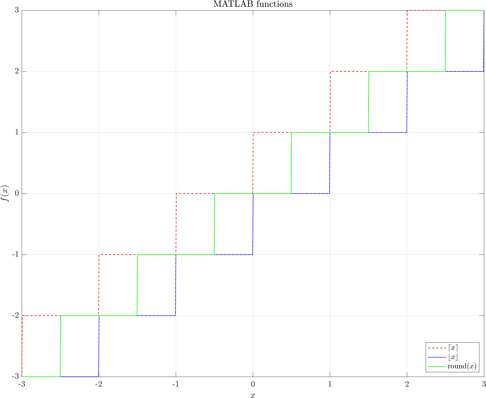
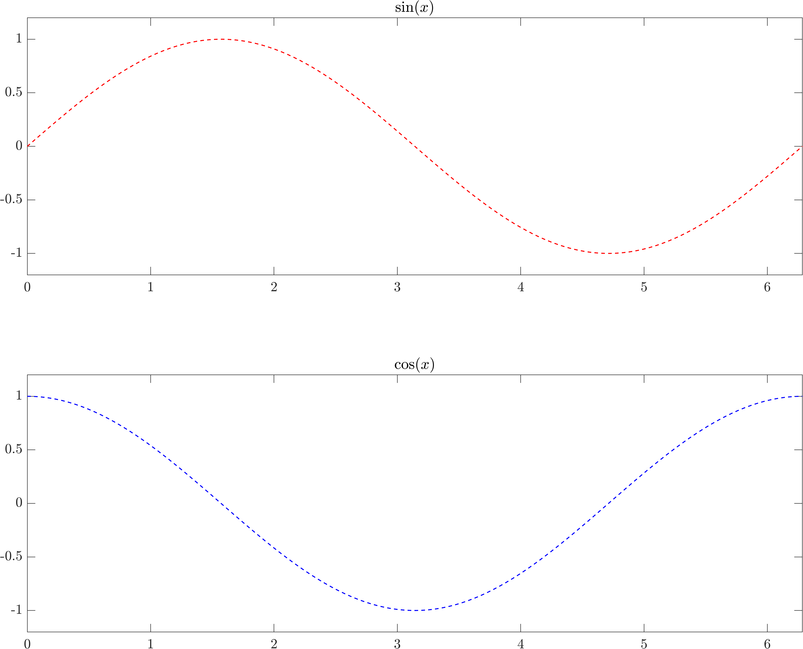
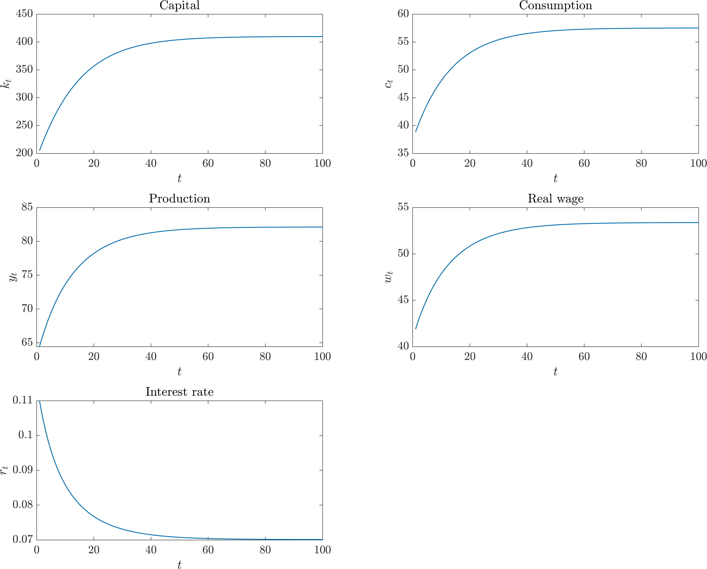
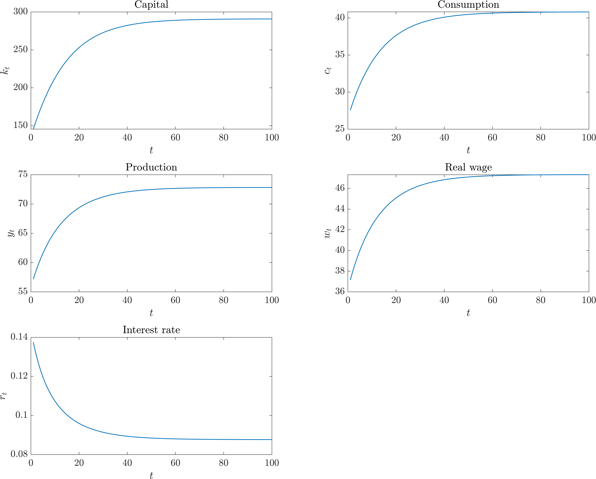
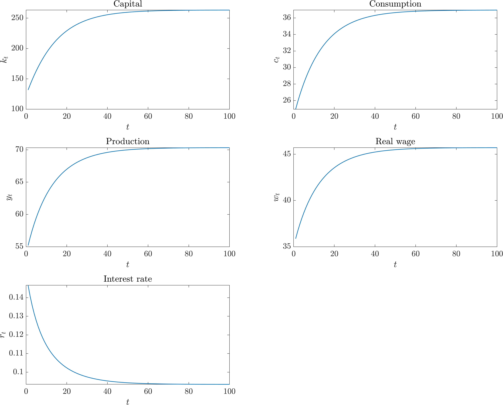
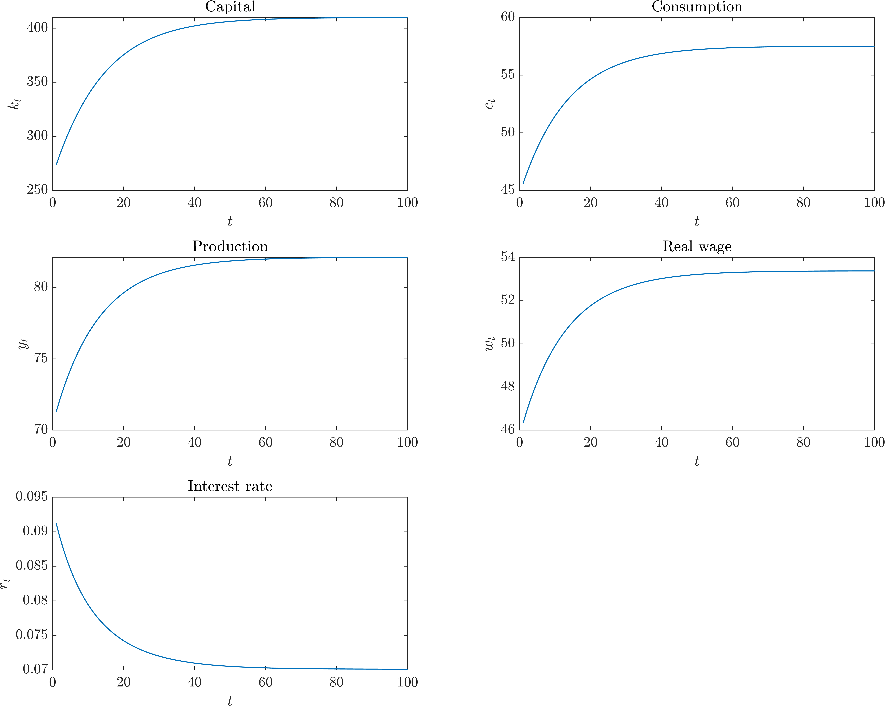
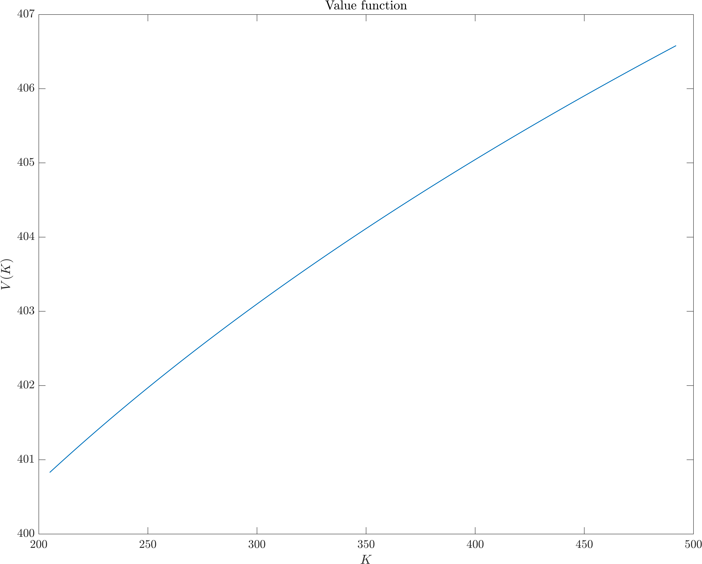
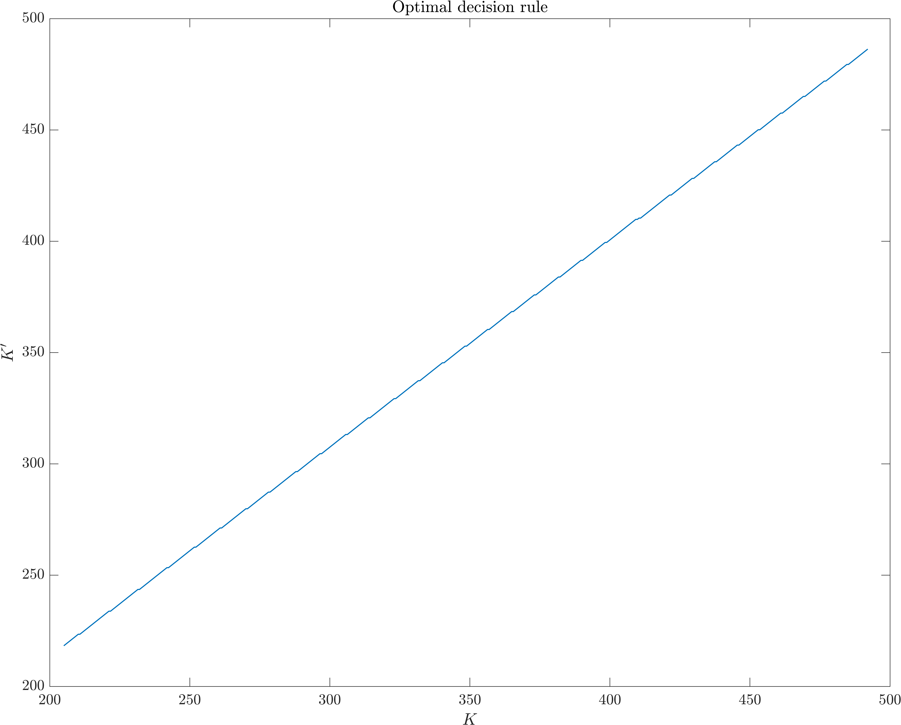

# 1st problem set

## Dynamic macroeconomics 1

###### Instituto Tecnológico Autónomo de México

###### Carlos Lezama

### Plots





<div style="page-break-after: always; break-after: page;"></div>

### Nonlinear equations / systems

Given the following function

$$
f(x) = \frac{5x - 4}{x - 1},
$$

such that, coding

```matlab
f = @(x) ((5 * x - 4) / (x - 1));

x = [0.75 0.87 1.02];

y = [];

for i = 1:length(x)
    y(i) = fsolve(f, x(i));
end

[x; y]'
```

our output is

```matlab
ans =

   1.0e+03 *

    0.0008    0.0008
    0.0009    0.0008
    0.0010    2.4431
```

Clearly, there is a vertical asymptote in $x = 1$. This is why, for our last guess $x_0 = 1.02$, the method cannot compute a Newton–Raphson solution.

<div style="page-break-after: always; break-after: page;"></div>

### Sequential Neoclassical growth model

#### No distortions



<div style="page-break-after: always; break-after: page;"></div>

#### Income taxation ($\tau = 0.2$)



<div style="page-break-after: always; break-after: page;"></div>

#### Income taxation ($\tau = 0.25$)



With a higher tax rate, capital, consumption, production, and real wages converge to lower stead- states while the interest rate converges faster to a higher level.

<div style="page-break-after: always; break-after: page;"></div>

### Recursive Neoclassical growth model







All code can be found [here](https://github.com/celj/dynamic-macroeconomics-spring-2022/tree/main/lab1/src).