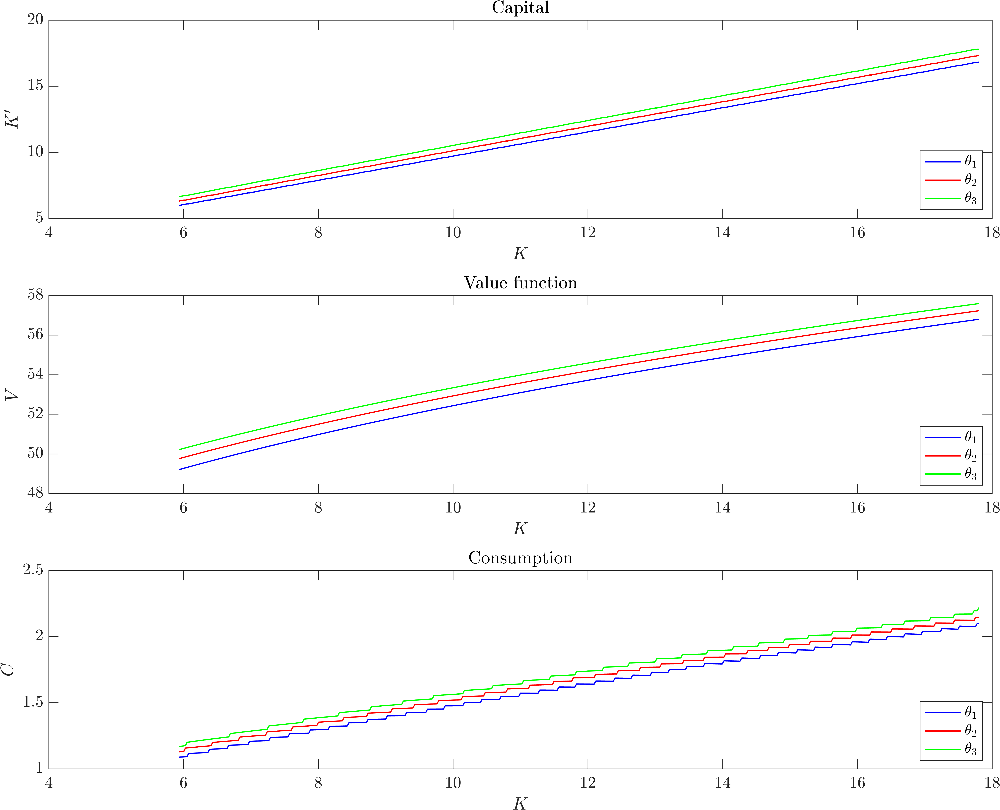
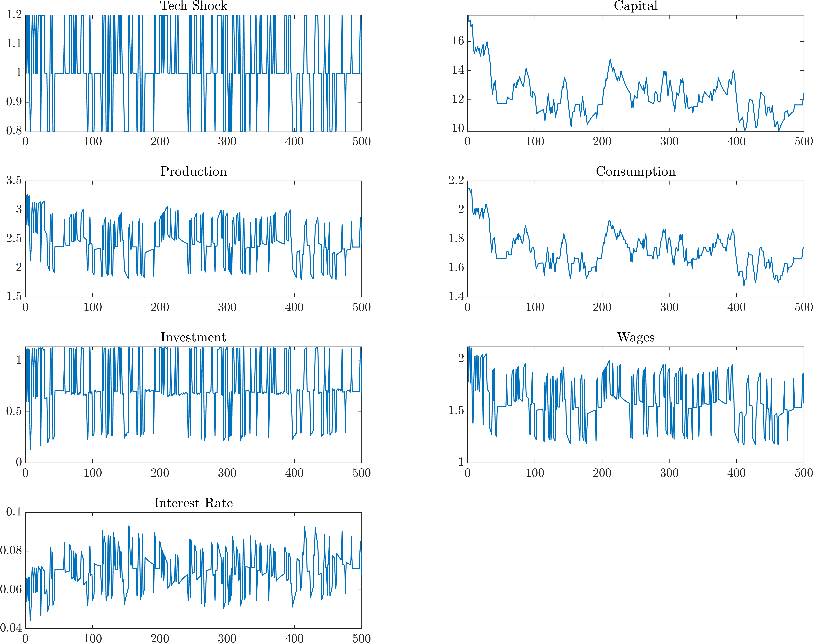

# 2nd problem set

## Dynamic macroeconomics 1

###### Instituto Tecnológico Autónomo de México

###### Carlos Lezama

### Stochastic Recursive Neoclassical Growth Model

Consider $u(c) = \log(c)$, and $f(k) = \theta k^\alpha$. Let $\alpha = 0.35$, $\beta = 0.99$, and $\delta = 0.06$. Suppose $\theta$ is a technological shock that follows a first-order discrete Markovian process which picks values $\{ 0.8, 1, 1.2 \}$ with the following transition matrix:

$$
\begin{bmatrix}
0.5 & 0.3 & 0.2 \\
0.1 & 0.7 & 0.2 \\
0.1 & 0.4 & 0.5
\end{bmatrix}
$$

#### 1.

A brute-force hack for finding the stationary distribution is simply to raise the transition matrix to a high power. Hence,

```matlab
n = 10000;

PI = [0.5, 0.3, 0.2;
      0.1, 0.7, 0.2;
      0.1, 0.4, 0.5];

asymptoticPI = PI^n

ans =

      0.16667      0.54762      0.28571
      0.16667      0.54762      0.28571
      0.16667      0.54762      0.28571
```

We can test if the resulting matrix is a stationary distribution as follows:

```matlab
asymptoticPI - (asymptoticPI * PI)

ans =

            0            0            0
   2.7756e-17  -1.1102e-16   5.5511e-17
   2.7756e-17  -1.1102e-16   5.5511e-17
```

<div style="page-break-after: always; break-after: page;"></div>

#### 2



<div style="page-break-after: always; break-after: page;"></div>

#### 3



<div style="page-break-after: always; break-after: page;"></div>

#### 4

##### Volatility

- Production: 0.14913
- Consumption: 0.072878
- Investment: 0.47354
- Wages: 0.14913
- Interest Rate: 0.13562

##### Correlation with production

- Consumption: 0.69097
- Investment: 0.92208
- Wages: 1
- Interest Rate: 0.68636
